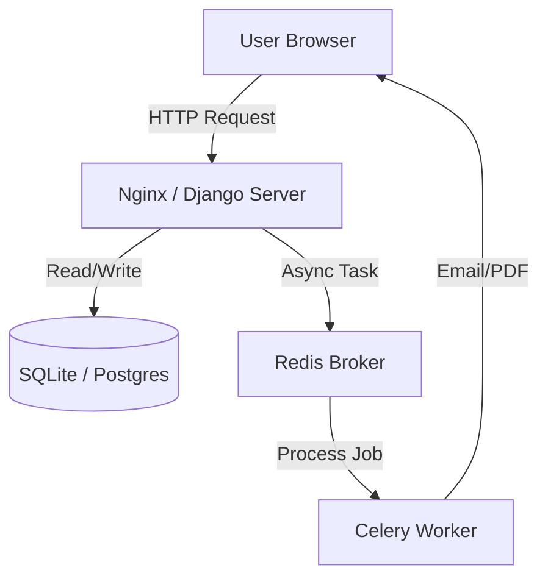
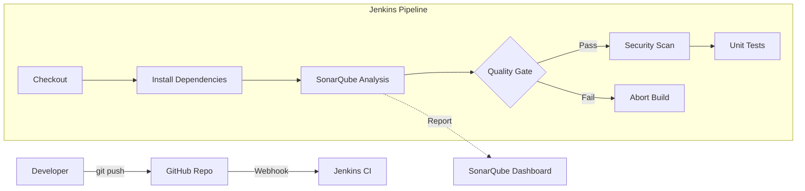

# Expenses Machine - Expense Tracker


A robust, full-stack Expense Tracker application designed for scalability and enterprise-grade DevOps practices. It features asynchronous task processing, comprehensive reporting, and a fully Dockerized CI/CD pipeline using Jenkins and SonarQube.

---

## 🏗️ System Architecture

### Application Flow
The application follows a micro-service-ready architecture, decoupling the web server from background processing.



### CI/CD Pipeline (DevOps)
Every code push triggers an automated quality & security pipeline.



---

## 🚀 Key Components & Code Highlights

### 1. Asynchronous Task Processing (`tasks.py`)
We use **Celery** to handle heavy lifting (like generating PDF reports) without freezing the UI.
```python
@shared_task
def generate_pdf_report(user_id):
    # This runs in the background
    user = User.objects.get(id=user_id)
    pdf = render_to_pdf('expenses/report.html', context)
    send_email(user.email, pdf)
```

### 2. DevOps Automation (`Jenkinsfile`)
Our pipeline logic is defined as code, ensuring reproducibility.
```groovy
stage('Quality Gate') {
    steps {
        timeout(time: 5, unit: 'MINUTES') {
            waitForQualityGate abortPipeline: true
        }
    }
}
```

---

## 💻 Setup Guide (Multi-OS)

Since the project is **Dockerized**, the setup experience is identical for **Windows**, **Linux**, and **macOS**.

### Prerequisites
-   **Docker Desktop** (Windows/Mac) or **Docker Engine** (Linux)
-   **Note**: Windows users must ensure WSL 2 is configured for best performance.

### Quick Start
1.  **Clone the Repository**
    ```bash
    git clone https://github.com/coderpravin/Expenes-Track-User.git
    cd Expenes-Track-User
    ```

2.  **Environment Setup**
    Create a `.env` file in `project/` with your credentials:
    ```ini
    EMAIL_HOST_USER=your_email@gmail.com
    EMAIL_HOST_PASSWORD=your_app_password
    ```

3.  **Launch Infrastructure**
    This command spins up **Jenkins**, **SonarQube**, and the **Web App** (plus Redis/Worker).
    ```bash
    docker-compose up -d --build
    ```

4.  **Access Services**
    -   **Web App**: `http://localhost:8000` (Running in Docker with auto-migrations)
    -   **Jenkins**: `http://localhost:8080`
    -   **SonarQube**: `http://localhost:9000`

---

## 📈 Scalability & Future Roadmap

This project is designed to grow from a single laptop to a global cloud deployment.

### How it Scales
1.  **Containerization**: The app is packaged in Docker, meaning "write once, run anywhere".
2.  **Stateless App Server**: We can run 10 Django containers behind a Load Balancer (AWS ALB) to handle millions of requests.
3.  **Horizontal Worker Scaling**: If report generation gets slow, we simply add more **Celery Worker** containers to consume queues from Redis faster.
4.  **Database Decoupling**: Currently SQLite (optimized with Docker Volumes), but the config allows switching to **AWS RDS (PostgreSQL)** by changing just one environment variable.

### Future Deployment Plan (AWS)
To take this to production, we will move from Local Docker Compose to **AWS**:

1.  **Code**: Stored in **GitHub**.
2.  **CI/CD**: Jenkins pushes Docker Images to **AWS ECR** (Elastic Container Registry).
3.  **Compute**: **AWS ECS (Fargate)** will run our Django and Celery containers serverlessly.
4.  **Data**:
    -   **RDS**: Managed PostgreSQL.
    -   **ElastiCache**: Managed Redis for queues.
    -   **S3**: Storing generated PDF reports.

---

## 🛠 Troubleshooting

-   **"Docker not found" in Jenkins**: Ensure you are using the custom `Dockerfile.jenkins` which installs the Docker CLI.
-   **Line Ending Errors**: If scripts fail on Windows/Linux boundaries, ensure `.gitattributes` is present to enforce LF line endings.
-   **SQLite "Disk I/O Error"**: We use a **Docker Named Volume** (`sqlite_data`) to store the database. This bypasses Windows/OneDrive file locking issues. Your database file is safe inside Docker, not in your Windows folder.